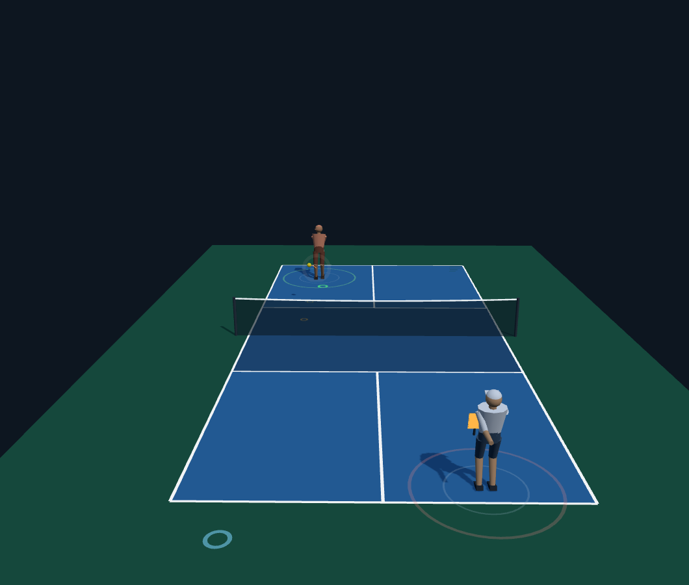

# Dink: Pickleball Rivals

A playable 3D pickleball prototype built with TypeScript, Three.js, and Electron. Play singles or doubles against computer opponents, climb an eight-rival career ladder, and review what cost you points after each game.



## Features

- Singles and doubles, with an AI partner and three difficulty levels.
- Best-of-three matches to 11, win by two, with side-out scoring, serve rotation, the two-bounce rule, and non-volley-zone faults.
- Ball flight, spin, bounce, and paddle contact simulated at a fixed 120 Hz.
- Opponent styles, local career progression, saved preferences, and Watch mode.
- Keyboard and gamepad input, three camera views, synthesised audio, and contact feedback.
- Input recordings for replay diagnostics and headless physics, rules, and gameplay tests.
- Browser development and an Electron desktop shell using the same game build.

This is a prototype, not a finished commercial release. The next milestone is outside playtesting on Windows; movement, onboarding, and balance still need validation.

## Run locally

Use Node.js 22.12 or newer and npm.

```sh
npm ci
npm run dev
```

Open the local URL printed by Vite. For a production preview:

```sh
npm run build
npm run preview
```

## Controls

| Input | Action |
| --- | --- |
| W / A / S / D | Move and aim: A/D across court, W short, S deep |
| Space | Serve or drive |
| J / K | Drop / lob |
| Escape | Pause or resume |
| R | Restart the match |
| M | Mute or unmute |

The direction held when you press a shot commits its aim. Plant your feet to hit a different direction from the one you were running. The blue ring predicts the contact location; the amber ring shows the current aim. A swing takes 120 ms to arrive. The default game speed is 60% of real time, adjustable in the panel.

The panel selects difficulty, singles/doubles, Watch mode, and camera view. Settings and career results are saved locally; in-progress matches are not restored after closing the game.

## Verify

```sh
npm run verify                 # TypeScript, unit tests, production build
npx playwright install chromium
npm run playtest:browser        # Real keyboard, DOM, and renderer checks
```

On Linux CI, install Chromium with `npx playwright install --with-deps chromium`. Browser screenshots go to ignored `artifacts/browser/`. Optional `PLAYWRIGHT_CHROMIUM_EXECUTABLE_PATH` overrides the managed browser. GitHub Actions runs both verification jobs.

The current unit suite contains 362 tests. Additional tools measure simulation behaviour; they do not replace human playtests:

```sh
npm run tally -- steady
npm run playtest -- 3
npm run perf
npm run doubles
npm run replay
```

## Desktop

```sh
npm run desktop               # Build and launch Electron
npm run desktop:win           # Package a portable Windows executable
```

Packages are written to ignored `release/`. Packaging scripts also exist for Linux and macOS. Native packaged-app launch testing remains part of the roadmap; a successful web build does not establish desktop readiness. The older `desktop:verify` command currently targets Linux.

## Architecture

| Directory | Responsibility |
| --- | --- |
| `src/sim/` | Pure physics, contact solver, movement, rules, opponents, and teams |
| `src/core/` | Fixed-step loop, input adapters, settings, career storage, and replays |
| `src/render/` | Three.js scene, court, player models, cameras, effects, and audio |
| `src/main.ts` | Application setup, screens, HUD, and match flow |
| `desktop/` | Sandboxed Electron shell and local asset protocol |
| `tests/`, `tools/` | Unit tests, browser checks, and gameplay measurements |

The simulation does not import Three.js. Players and AI act through input frames, and seeded randomness enables deterministic replay checks within a compatible simulation version. Visual effects use real elapsed time independently of the fixed simulation timestep.

## Known limitations and next steps

- Changing difficulty during a game is not captured by the replay and can alter a career challenge.
- A career challenge started in Watch mode can incorrectly award progress.
- Clipboard denial sends replay data to the developer console; starting the next game replaces the recording.
- Documented simulation measurements show too many unreachable balls; movement and shot balance need work.
- Some legacy screenshot, packaging, and artifact tools still assume the original Linux environment. The browser CI harness uses portable paths.
- No online multiplayer or public hosted demo is included in this repository publication.

Read the [Windows playtest roadmap](docs/playtest-roadmap.md) for the next milestone. The [100-day roadmap](docs/plan-100.md) is a longer-term proposal dependent on playtest evidence.

The [architecture records](docs/adr/) explain design decisions. The [technical overview](docs/technical-overview.md) preserves the earlier engineering narrative and historical measurements; its day counts and status claims are historical. See also the [day log](docs/daylog.md) and [backlog](docs/backlog.md).

## Project description

> Dink: Pickleball Rivals is a 3D sports-game prototype featuring a deterministic TypeScript physics engine, AI singles and doubles, and local career progression. Built with Three.js and Electron, it separates simulation from rendering and verifies gameplay through unit tests and automated browser playtests.
